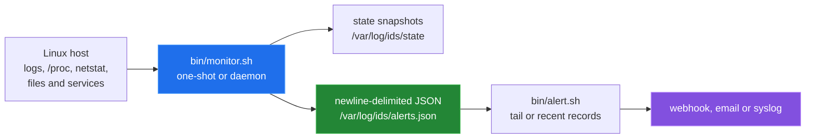
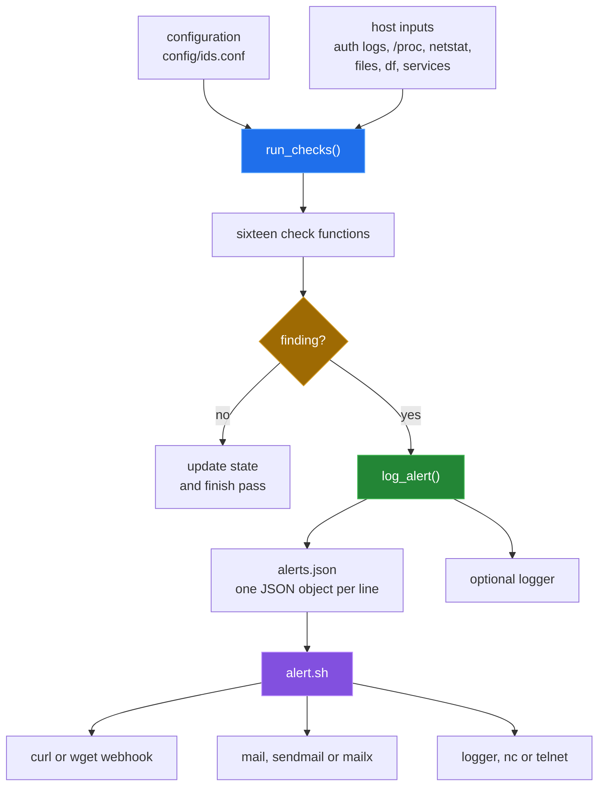

# posix-ids


> Zero-dependency intrusion detection for Linux servers that ships alerts as JSON straight into Splunk.

`posix-ids` is a set of POSIX shell scripts for checking a Linux host for
authentication anomalies, file and process changes, resource pressure, and
selected network and configuration changes. The monitor keeps small state
snapshots, writes newline-delimited JSON, and has a separate alert router for
webhooks, email, and syslog. The repository also contains Ansible deployment
and Splunk configuration. Bugs are tracked as
[GitHub issues](https://github.com/Bissbert/posix-ids/issues).



## Why

Most IDS tools require a Python runtime, a specific init system, or a proprietary agent. posix-ids runs in any POSIX sh — dash, ash, BusyBox — so it works on minimal containers, Alpine hosts, and locked-down OT appliances alike. It completes the trilogy alongside [POSIX-hardening](https://github.com/Bissbert/POSIX-hardening) and [splunk-security-alerts](https://github.com/Bissbert/splunk-security-alerts): harden the host, detect intrusions, and surface alerts in Splunk.

## Quick start

Install on a host:

```bash
git clone https://github.com/Bissbert/posix-ids.git
cd posix-ids

# Single server — manual install
sudo ./bin/setup.sh

# One pass, then read the alerts
sudo /usr/local/bin/ids_monitor -c /etc/ids/ids_config.conf -1
sudo tail /var/log/ids/alerts.json
```

For several hosts, `playbooks/site.yml` deploys the same scripts with Ansible;
see [docs/ansible-deployment.md](docs/ansible-deployment.md).

### Try it in a container first

```sh
# Install, run the tests and check the baseline and syslog paths in a disposable Debian container.
sh tools/linux-run.sh

# Run the monitor against harmless test artefacts in a disposable Debian container.
sh tools/container_run.sh

# Regression suite: shell tests, static Splunk and Ansible checks, and an Ansible deploy.
sh tests/docker.sh
```

All three need Docker and change nothing on the host. The installer, the
monitor and the test script all read and write system paths such as
`/var/log/ids` and `/etc/ids`, so try them in a container before a real host.

## Components

- `bin/monitor.sh` — continuous monitoring loop (daemon, oneshot, or interactive). Runs checks for brute-force attempts, port scans, file integrity, SUID changes, webshells, cryptominers, hidden processes, SSH/cron config drift, and resource exhaustion. Outputs newline-delimited JSON to `/var/log/ids/alerts.json`.
- `bin/alert.sh` — reads the alert log and forwards events to a Slack-compatible webhook, email (`mail`/`sendmail`/`mailx`), or a TCP/local syslog endpoint.
- `bin/baseline.sh` — `-n` writes the SHA-256 baseline of the critical files that the monitor's integrity check reads, `-S` a broad review snapshot under `/var/lib/ids/baseline`, and `-V` verifies the files against the baseline. See [docs/baseline-and-operation.md](docs/baseline-and-operation.md).
- `bin/setup.sh` — installs the scripts as `ids_monitor`, `ids_baseline` and `ids_alert`, the config as `/etc/ids/ids_config.conf`, a systemd unit (or an init.d script without systemd), the initial baseline, and a daily cron entry that refreshes the review snapshot.
- `splunk/` — drop-in Splunk Universal Forwarder config (`inputs.conf`, `props.conf`, `savedsearches.conf`) plus a pre-built XML dashboard.
- Ansible roles in `roles/` handle multi-host deployment, logrotate, sudoers, and systemd/cron service wiring.
- `tests/` — `tests/test.sh` checks an installed host; `tests/docker.sh` runs the regression suite in containers.

## Architecture

The monitor is a single POSIX shell process. Each check reads its source, may
compare it with a state snapshot, and calls one JSON logging function. The
alert script is a separate process; the monitor does not invoke it.



The monitor runs once with `-1`, continuously in its default loop, or in
daemon mode with `-d`. Its configured default interval is 60 seconds. The
authentication checks count log lines stamped within `AUTH_WINDOW` (300 s) or
`SUDO_WINDOW` (3600 s).

## Capability table

| Area | Implemented coverage | Severity emitted |
|---|---|---|
| Network | Current `netstat` connections: possible port scan and non-whitelisted remote ports | high / medium |
| Authentication | Failed SSH/authentication lines and sudo use within a time window, and new `/etc/passwd` users | critical / high / medium |
| Filesystem | Critical-file checksums, new SUID/SGID files in selected system directories, and PHP webshell patterns | critical / high |
| Processes | Miner-name matches, `/proc` versus `ps` PID differences, and deleted executable links | critical / high |
| Resources | CPU, memory, disk, and process-count thresholds | medium / high |
| Configuration | Selected SSH settings, cron snapshots, and newly observed running services | high / medium |
| Alert routing | Newline-delimited JSON plus optional webhook, email, and syslog delivery | configured by caller |
| Splunk | Configuration files for inputs, JSON parsing, saved searches, and a dashboard | checked statically; not run |

The exact input, predicate, state file, and blind spot for every check are in
[`docs/detection-pipeline.md`](docs/detection-pipeline.md).

## Configuration

Edit `/etc/ids/ids_config.conf` after installation. Key variables:

| Variable | Default | Description |
|---|---|---|
| `BRUTE_FORCE_THRESHOLD` | `5` | Failed SSH logins before alert |
| `PORT_SCAN_THRESHOLD` | `10` | Connections per IP before alert |
| `CPU_THRESHOLD` | `80` | CPU % before alert |
| `CHECK_INTERVAL` | `60` | Seconds between monitoring cycles |
| `ALERT_TO_FILE` | `1` | Write JSON to alert log |
| `AUTH_WINDOW` | `300` | Seconds of auth log the brute-force and failed-login checks read |
| `SUDO_WINDOW` | `3600` | Seconds of auth log the sudo check reads |
| `ALERT_TO_SYSLOG` | `1` | Forward to syslog as `auth.crit`, `auth.err`, `auth.warning` or `auth.notice` by severity |

## Results

From `sh tools/linux-run.sh` in `debian:12-slim` (Linux 6.5.11, aarch64), on
2026-09-24. Details are in [docs/measurement.md](docs/measurement.md).

| Command | Result |
|---|---|
| `sh tools/measure.sh` | 75,576 implementation shell/Jinja bytes; 16 checks; syntax pass |
| `sh bin/monitor.sh -h`, `sh bin/alert.sh -h` | exit 0 |
| `sh bin/setup.sh -s`, then `sh bin/setup.sh` | exit 0; all three scripts and the config installed |
| `sh tests/test.sh` | all 10 tests run, fresh install or not; 11 passed, 1 failed (no auth log in the container) |
| `sh bin/baseline.sh -n`, then `-V` | baseline written; `-V` exit 0 |
| `sh tools/container_run.sh` | warm pass exit 0; 13 JSON alerts for 9 planted artefacts; 0.31 s |
| `sh tests/docker.sh` | 239 checks passed, 0 failed |

## Repository layout

```text
bin/                    monitor, baseline, alert and setup shell scripts
config/                 runtime configuration
roles/                  Ansible role tasks and Jinja templates
playbooks/              Ansible deployment and maintenance playbooks
inventory/              staging and production inventory examples
splunk/                 Splunk inputs, field parsing, searches and dashboard
tests/                  host test script and the Docker regression suite
examples/               Ansible deployment and maintenance examples
docs/                   graphical overview, subsystem write-ups and measurements
tools/                  measurement script and container harnesses
```

## Known limitations

- The authentication windows only understand the traditional syslog stamp and
  RFC 3339 stamps; lines in other formats are ignored. Port-scan detection is a
  snapshot of current `netstat` output, not a historical connection window.
- The Splunk files are checked statically; Splunk itself has not been run
  against them.
- The Ansible deployment was run against `localhost` in a container with the
  cron service type. The systemd service type and remote hosts were not
  exercised.
- The monitor depends on host tools and permissions, including `/proc`,
  `netstat` or equivalent availability, readable authentication logs, and
  access to the watched paths. The container harnesses install `procps` and
  `net-tools` inside their container for that reason.

## Status

Actively maintained.

## License

MIT
