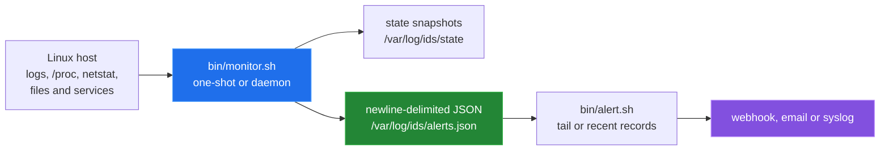
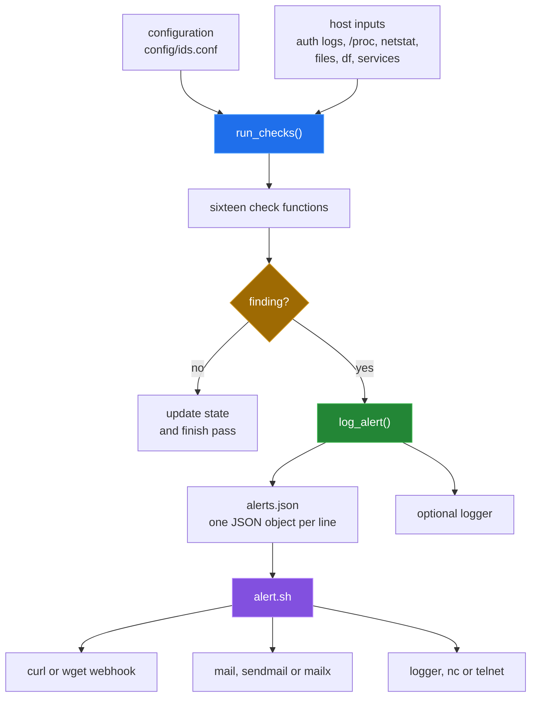

# POSIX Linux Intrusion Detection System

`posix-ids` is a set of POSIX shell scripts for checking a Linux host for
authentication anomalies, file and process changes, resource pressure, and
selected network and configuration changes. The monitor keeps small state
snapshots, writes newline-delimited JSON, and has a separate alert router for
webhooks, email, and syslog. The repository also contains Ansible deployment
scaffolding and Splunk configuration; those integration paths are described as
they exist, including the mismatches recorded in
[`docs/BUGS-FOUND.md`](docs/BUGS-FOUND.md).



## Quick start

These commands are the verified source-level and container-level entry points:

```sh
# Check every tracked shell script and list the monitor checks.
sh tools/measure.sh

# Show the two directly runnable command interfaces.
sh bin/monitor.sh -h
sh bin/alert.sh -h

# Run the monitor against harmless artefacts in a disposable Debian container.
sh tools/container_run.sh
```

The container harness installs only its measurement utilities inside the
throwaway container. It creates an isolated baseline, runs a cold pass, adds
test artefacts, and runs a warm pass. It does not install anything on the host.
The host installer is not presented as a working quick start because
`bin/setup.sh` currently names files that are not in `bin/`; see
[`docs/BUGS-FOUND.md`](docs/BUGS-FOUND.md).

## Architecture

The monitor is a single POSIX shell process. Each check reads its source, may
compare it with a state snapshot, and calls one JSON logging function. The
alert script is a separate process; the monitor does not invoke it.



The monitor runs once with `-1`, continuously in its default loop, or in
daemon mode with `-d`. Its configured default interval is 60 seconds, but the
current code does not apply a real-time filter to the authentication log
counts; it uses fixed line counts instead.

## Capability table

| Area | Implemented coverage | Severity emitted |
|---|---|---|
| Network | Current `netstat` connections: possible port scan and non-whitelisted remote ports | high / medium |
| Authentication | Failed SSH/authentication lines, excessive failures, new `/etc/passwd` users, and sudo line counts | critical / high / medium |
| Filesystem | Critical-file checksums, new SUID/SGID files in selected system directories, and PHP webshell patterns | critical / high |
| Processes | Miner-name matches, `/proc` versus `ps` PID differences, and deleted executable links | critical / high |
| Resources | CPU, memory, disk, and process-count thresholds | medium / high |
| Configuration | Selected SSH settings, cron snapshots, and newly observed running services | high / medium |
| Alert routing | Newline-delimited JSON plus optional webhook, email, and syslog delivery | configured by caller |
| Splunk | Configuration files for inputs, JSON parsing, saved searches, and a dashboard | intent only; see limitations |

The exact input, predicate, state file, and blind spot for every check are in
[`docs/detection-pipeline.md`](docs/detection-pipeline.md).

## Measured results

The repository measurement script reported 73606 bytes of implementation shell
and Jinja source, 16 monitor check functions, and passing shell syntax checks.
Those values come from `sh tools/measure.sh`.

The disposable-container run used Debian GNU/Linux 12 with `dash`, installed
`procps` and `net-tools`, and ran the checked-in monitor directly. Its warm
pass exited with status 0 and wrote 13 alert records for the planted artefacts.
The measured wall-clock delta for that pass was 257238750 nanoseconds. This is
one container run, not a performance guarantee.

| Command | Result |
|---|---|
| `sh tools/measure.sh` | 73606 implementation shell/Jinja bytes; 16 checks; syntax pass |
| `sh bin/monitor.sh -h` | help displayed |
| `sh bin/alert.sh -h` | help displayed |
| `sh tools/container_run.sh` | warm pass exit 0; 13 JSON alerts; 257238750 ns wall delta |

## Repository layout

```text
bin/                    monitor, baseline, alert and setup shell scripts
config/                 runtime configuration
roles/                  Ansible role tasks and Jinja templates
playbooks/              Ansible deployment and maintenance playbooks
inventory/              staging and production inventory examples
splunk/                 Splunk inputs, field parsing, searches and dashboard
tests/                  installation-oriented shell test script
examples/               Ansible deployment and maintenance examples
docs/                   graphical overview, subsystem write-ups and measurements
tools/                  measurement harnesses used by this documentation pass
```

## Known limitations

- The host installer stops on its first missing script name. The documented
  container path invokes `monitor.sh` directly and does not claim to validate
  installation.
- The baseline generator and monitor use different paths and formats, so a
  baseline generated by `bin/baseline.sh` is not the baseline input that
  `bin/monitor.sh` reads.
- Authentication thresholds operate on the last fixed number of log lines, not
  timestamps. Port-scan detection is a snapshot of current `netstat` output,
  not a historical connection window.
- The Splunk files currently point at paths and schemas that do not match the
  monitor's `alerts.json` records. Splunk was not run in this pass.
- The Ansible graph references absent roles, task files, templates and
  unsupported baseline options. No remote host was contacted.
- The monitor depends on host tools and permissions, including `/proc`,
  `netstat` or equivalent availability, readable authentication logs, and
  access to the watched paths. The container harness installs only the tools it
  needs for its own isolated run.
