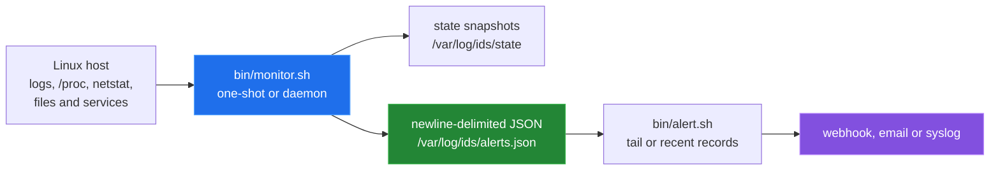
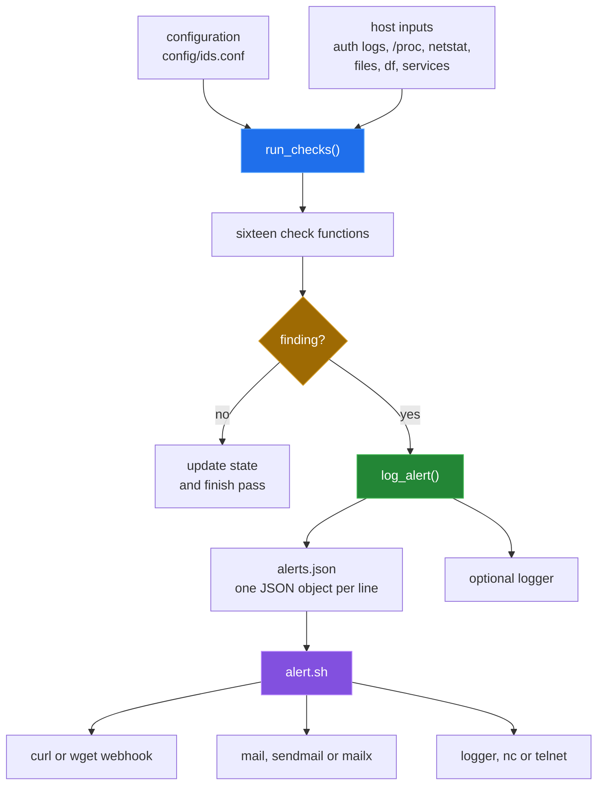

# posix-ids


> Zero-dependency intrusion detection for Linux servers that ships alerts as JSON straight into Splunk.

`posix-ids` is a set of POSIX shell scripts for checking a Linux host for
authentication anomalies, file and process changes, resource pressure, and
selected network and configuration changes. The monitor keeps small state
snapshots, writes newline-delimited JSON, and has a separate alert router for
webhooks, email, and syslog. The repository also contains Ansible deployment
scaffolding and Splunk configuration; those integration paths are described as
they exist, including the mismatches recorded in
[`docs/BUGS-FOUND.md`](docs/BUGS-FOUND.md).



## Why

Most IDS tools require a Python runtime, a specific init system, or a proprietary agent. posix-ids runs in any POSIX sh — dash, ash, BusyBox — so it works on minimal containers, Alpine hosts, and locked-down OT appliances alike. It completes the trilogy alongside [POSIX-hardening](https://github.com/Bissbert/POSIX-hardening) and [splunk-security-alerts](https://github.com/Bissbert/splunk-security-alerts): harden the host, detect intrusions, and surface alerts in Splunk.

## Quick start

Install on a host:

```bash
git clone https://github.com/Bissbert/posix-ids.git
cd posix-ids

# Single server — manual install
sudo ./bin/setup.sh

# One pass, then read the alerts
sudo /usr/local/bin/ids_monitor -c /etc/ids/ids_config.conf -1
sudo tail /var/log/ids/alerts.json
```

The Ansible playbooks in `playbooks/` still reference roles and templates that
do not exist ([bug 7](docs/BUGS-FOUND.md#7-ansible-references-absent-roles-includes-and-templates)),
so they are not a working install path yet.

### Try it in a container first

```sh
# Install, run the tests and check the open bugs in a disposable Debian container.
sh tools/linux-run.sh

# Run the monitor against harmless test artefacts in a disposable Debian container.
sh tools/container_run.sh
```

Both scripts need Docker and change nothing on the host. The installer, the
monitor and the test script all read and write system paths such as
`/var/log/ids` and `/etc/ids`, so try them in a container before a real host.

## Components

- `bin/monitor.sh` — continuous monitoring loop (daemon, oneshot, or interactive). Runs checks for brute-force attempts, port scans, file integrity, SUID changes, webshells, cryptominers, hidden processes, SSH/cron config drift, and resource exhaustion. Outputs newline-delimited JSON to `/var/log/ids/alerts.json`.
- `bin/alert.sh` — reads the alert log and forwards events to a Slack-compatible webhook, email (`mail`/`sendmail`/`mailx`), or a TCP/local syslog endpoint.
- `bin/baseline.sh` — writes a broad MD5 and system snapshot under `/var/lib/ids/baseline`. The monitor's integrity check reads a different file, so this snapshot is not used by it yet ([bug 2](docs/BUGS-FOUND.md#2-baseline-generator-does-not-produce-the-monitors-baseline)).
- `bin/setup.sh` — installs the scripts as `ids_monitor`, `ids_baseline` and `ids_alert`, the config as `/etc/ids/ids_config.conf`, a systemd unit (or an init.d script without systemd), and a daily baseline cron entry.
- `splunk/` — drop-in Splunk Universal Forwarder config (`inputs.conf`, `props.conf`, `savedsearches.conf`) plus a pre-built XML dashboard.
- Ansible roles in `roles/` handle multi-host deployment, logrotate, sudoers, and systemd/cron service wiring.

## Architecture

The monitor is a single POSIX shell process. Each check reads its source, may
compare it with a state snapshot, and calls one JSON logging function. The
alert script is a separate process; the monitor does not invoke it.



The monitor runs once with `-1`, continuously in its default loop, or in
daemon mode with `-d`. Its configured default interval is 60 seconds, but the
current code does not apply a real-time filter to the authentication log
counts; it uses fixed line counts instead.

## Capability table

| Area | Implemented coverage | Severity emitted |
|---|---|---|
| Network | Current `netstat` connections: possible port scan and non-whitelisted remote ports | high / medium |
| Authentication | Failed SSH/authentication lines, excessive failures, new `/etc/passwd` users, and sudo line counts | critical / high / medium |
| Filesystem | Critical-file checksums, new SUID/SGID files in selected system directories, and PHP webshell patterns | critical / high |
| Processes | Miner-name matches, `/proc` versus `ps` PID differences, and deleted executable links | critical / high |
| Resources | CPU, memory, disk, and process-count thresholds | medium / high |
| Configuration | Selected SSH settings, cron snapshots, and newly observed running services | high / medium |
| Alert routing | Newline-delimited JSON plus optional webhook, email, and syslog delivery | configured by caller |
| Splunk | Configuration files for inputs, JSON parsing, saved searches, and a dashboard | intent only; see limitations |

The exact input, predicate, state file, and blind spot for every check are in
[`docs/detection-pipeline.md`](docs/detection-pipeline.md).

## Configuration

Edit `/etc/ids/ids_config.conf` after installation. Key variables:

| Variable | Default | Description |
|---|---|---|
| `BRUTE_FORCE_THRESHOLD` | `5` | Failed SSH logins before alert |
| `PORT_SCAN_THRESHOLD` | `10` | Connections per IP before alert |
| `CPU_THRESHOLD` | `80` | CPU % before alert |
| `CHECK_INTERVAL` | `60` | Seconds between monitoring cycles |
| `ALERT_TO_FILE` | `1` | Write JSON to alert log |
| `ALERT_TO_SYSLOG` | `1` | Forward to syslog. The priority names it builds are rejected by Debian's `logger` ([bug 3](docs/BUGS-FOUND.md#3-syslog-priority-built-from-an-ids-severity)); set `0` until that is fixed. |

## Results

From `sh tools/linux-run.sh` in `debian:12-slim` (Linux 6.5.11, aarch64), on
2026-09-24. Details are in [docs/measurement.md](docs/measurement.md).

| Command | Result |
|---|---|
| `sh tools/measure.sh` | 73,538 implementation shell/Jinja bytes; 16 checks; syntax pass |
| `sh bin/monitor.sh -h`, `sh bin/alert.sh -h` | exit 0 |
| `sh bin/setup.sh -s`, then `sh bin/setup.sh` | exit 0; all three scripts and the config installed |
| `sh tests/test.sh` | stops at Test 8 on a fresh install ([bug 10](docs/BUGS-FOUND.md#10-test-script-stops-at-test-8-on-a-fresh-install)); otherwise 10 passed, 2 failed (no baseline, no auth log) |
| `sh tools/container_run.sh` | warm pass exit 0; 13 JSON alerts for 9 planted artefacts; 0.31 s |

## Repository layout

```text
bin/                    monitor, baseline, alert and setup shell scripts
config/                 runtime configuration
roles/                  Ansible role tasks and Jinja templates
playbooks/              Ansible deployment and maintenance playbooks
inventory/              staging and production inventory examples
splunk/                 Splunk inputs, field parsing, searches and dashboard
tests/                  installation-oriented shell test script
examples/               Ansible deployment and maintenance examples
docs/                   graphical overview, subsystem write-ups and measurements
tools/                  measurement script and container harnesses
```

## Known limitations

- The baseline generator and monitor use different paths and formats, so a
  baseline generated by `bin/baseline.sh` is not the baseline input that
  `bin/monitor.sh` reads.
- Authentication thresholds operate on the last fixed number of log lines, not
  timestamps. Port-scan detection is a snapshot of current `netstat` output,
  not a historical connection window.
- The Splunk files currently point at paths and schemas that do not match the
  monitor's `alerts.json` records. Splunk itself has not been run against it.
- The Ansible graph references absent roles, task files, templates and
  unsupported baseline options. No remote host was contacted.
- The monitor depends on host tools and permissions, including `/proc`,
  `netstat` or equivalent availability, readable authentication logs, and
  access to the watched paths. The container harnesses install `procps` and
  `net-tools` inside their container for that reason.
- With the default `ALERT_TO_SYSLOG=1`, the monitor passes IDS severities such
  as `medium` to `logger` as priorities, which Debian's `logger` rejects.
- `tests/test.sh` stops at Test 8 when `alerts.json` has no other records, as on
  a fresh install.

## Status

Actively maintained.

## License

MIT
