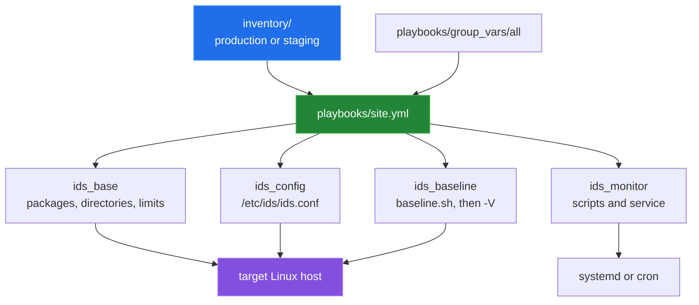

# Ansible deployment scaffolding

[← back to the overview](../README.md)

The Ansible tree deploys the shell scripts to the `ids_servers` group. The
inventories define service mode, paths, thresholds and optional Splunk
settings; the shared variables live in `playbooks/group_vars/all/main.yml`,
next to the playbooks, so every playbook loads them. `playbooks/site.yml`
composes base setup, configuration, the monitor and the baseline.

## What the roles do

| Role or layer | Responsibility |
|---|---|
| `ids_base` | preflight, package installation, directories, optional dedicated user, sysctl and limits, sudoers and log rotation; owns the shared handlers |
| `ids_config` | renders `ids.conf.j2` (every key `config/ids.conf` has), thresholds and checks files, and checks the result with `sh -n` |
| `ids_monitor` | copies `monitor.sh`, `baseline.sh`, `alert.sh` and `setup.sh`; renders the wrapper, status and health-check scripts; configures systemd or cron |
| `ids_baseline` | backs up an existing baseline, runs `baseline.sh -c /etc/ids/ids.conf`, verifies with `-V` and renders metadata |
| `inventory/*` | host groups plus environment-specific paths, service settings, intervals, retention and alert/Splunk variables |
| `playbooks/*` | complete deployment, focused deployment, updates, checks, baseline actions (`generate`, `snapshot`, `verify`, `compare`) and removal |

Every script the roles install is called with `-c /etc/ids/ids.conf`, so the
deployed monitor reads the configuration Ansible renders.

## Service boundaries

`ids_service_type` is `systemd` or `cron`:

- systemd starts `ids-wrapper.sh`, which runs `monitor.sh -d`, and an optional
  timer runs `baseline.sh -S` to refresh the review snapshot;
- cron runs `ids-cron-wrapper.sh monitor` every `ids_check_interval` and
  `ids-cron-wrapper.sh baseline` (also `-S`) nightly.

Neither schedule rewrites the monitor baseline; `playbooks/baseline.yml -e
action=generate` does that on request.

## Vault

The inventories read their webhook URLs from `vault_*` variables with an empty
default. `ansible.cfg` no longer names a vault password file; pass
`--vault-password-file` or `--ask-vault-pass` when a vault is in use.

## Verification status

`tests/ansible/deploy.sh` runs in the Ansible image that `sh tests/docker.sh`
builds (ansible-core 2.17). Against `localhost` inside the container, with the
cron service type, it:

- runs `--syntax-check` on every playbook;
- runs `site.yml`, then checks the rendered `/etc/ids/ids.conf`, the monitor
  baseline, the crontab entry, one monitor pass through the cron wrapper, and
  the status and health-check scripts;
- runs `deploy.yml`, `baseline.yml` with `action=verify` and
  `action=snapshot` (the monitor baseline stays unchanged), and `check.yml`.

`tests/static/ansible_refs.py` checks that every role, task file, template,
file and handler the playbooks name exists, and that the flags passed to the
scripts are ones they accept. The systemd service type and remote hosts were
not exercised.
