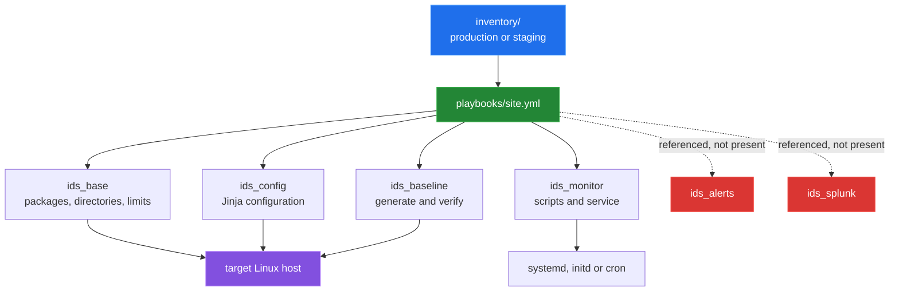

# Ansible deployment scaffolding

[← back to the overview](../README.md)

The Ansible tree is a deployment design layered around the shell scripts. The
inventories define `ids_servers`, service mode, paths, thresholds and optional
Splunk settings. `playbooks/site.yml` is intended to compose base setup,
monitoring, configuration, alerts, baselines and Splunk roles.

## What the existing roles describe

| Role or layer | Current responsibility in the tree |
|---|---|
| `ids_base` | preflight, package installation, directories, optional dedicated user, sysctl and limits, sudoers and log rotation |
| `ids_monitor` | copies `monitor.sh`, `baseline.sh`, `alert.sh` and `setup.sh`; renders service helpers; configures service mode |
| `ids_config` | renders `ids.conf.j2`, thresholds and additional check configuration; validates the rendered configuration |
| `ids_baseline` | backs up a current baseline, calls a generate/verify interface, sets permissions and renders metadata |
| `inventory/*` | host groups plus environment-specific paths, service settings, intervals, retention and alert/Splunk variables |
| `playbooks/*` | complete deployment, focused deployment, updates, checks, baseline actions and removal |

The roles are more ambitious than the scripts currently present. For example,
the baseline role passes command-line options that `bin/baseline.sh` does not
parse, and `playbooks/site.yml` names roles that do not exist; see
[bug 7](BUGS-FOUND.md#7-ansible-references-absent-roles-includes-and-templates).

## Service boundaries

The Ansible templates support three service shapes:

- systemd starts a wrapper and manages a unit and optional baseline timer;
- initd starts the monitor through an init script;
- cron invokes a wrapper for monitoring, baseline work and alert checks.

The deployed monitor still reads the shell configuration contract described in
[`detection-pipeline.md`](detection-pipeline.md). The templates introduce a
second configuration vocabulary (`ids.conf`, thresholds and checks files), so
the rendered values need a tested mapping before a deployment can be trusted.

## Verification status

The local Ansible executable was available, but the repository's
`ansible.cfg` points at `~/.ansible/vault_pass.txt`, which was absent. The
syntax-check command therefore stopped before contacting a host. No inventory
host was contacted, no vault password was guessed, and no deployment was run.

The missing root task files, roles and templates are listed with locations and
reproduction steps in [`BUGS-FOUND.md`](BUGS-FOUND.md). This write-up records
the scaffolding as checked in; it does not imply that the deployment is
currently executable end to end.
