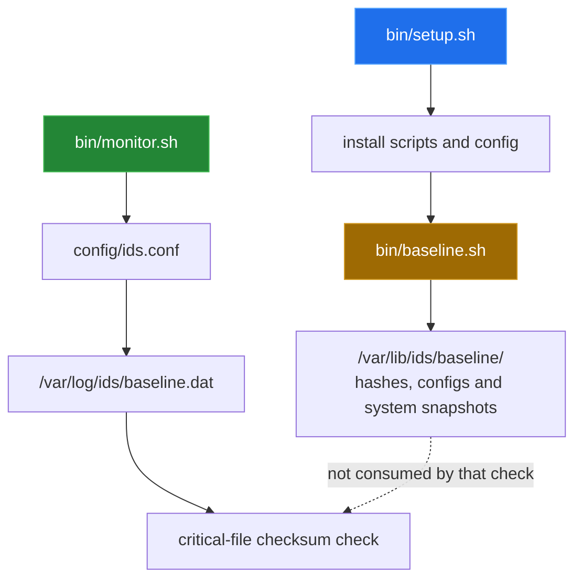

# Baselines and operation

[← back to the overview](../README.md)

The repository has two related but currently incompatible baseline concepts.
`bin/baseline.sh` is a broad snapshot generator under `/var/lib/ids/baseline`.
`bin/monitor.sh` is a narrow live checker that expects a flat file at
`/var/log/ids/baseline.dat` for its critical-file checksum comparison.



## What the broad generator records

`bin/baseline.sh` writes a timestamped directory tree containing:

| Snapshot area | Source data |
|---|---|
| `hashes/` | MD5 lists for system binary directories and selected web files |
| `system/` | SUID/SGID paths, users and groups, packages, network, services, kernel modules, processes, system facts and directory listings |
| `configs/cron/` | system and user cron material when readable |
| `configs/` | copies and MD5 records for selected SSH, sudo, resolver, PAM, sysctl, logging and rotation files |
| `system/ssh_key_locations.txt` | selected key filenames below `/home` |
| `configs/init/` | systemd, init scripts and `rc.local` when present |
| `baseline_summary.txt` | counts and a textual summary |
| `verify_baseline.sh` | a generated verifier for hashes, SUID/SGID paths and `/etc/passwd` |
| `baseline_splunk.json` | a generated summary intended for Splunk |

The generator also attempts to collect optional command output such as
`ifconfig`, `ip`, `netstat`, `ss`, `iptables`, `lsof`, `free` and `mount`. A
missing optional command can leave an incomplete snapshot; the script does not
turn that snapshot into the flat file consumed by the live monitor.

## Runtime state

The monitor creates `/var/log/ids/state` and keeps comparison files for SUID/SGID
paths, users, SSH settings, cron content and observed services. It also creates
short-lived PID lists for the process comparison and stores a last-check epoch.
The JSON alert file and monitor log are rotated when they exceed the configured
maximum size. The configured value is 10485760 bytes and the configured number
of rotated files is 5; both values come from `config/ids.conf`.

The monitor can be invoked from source for a single pass:

```sh
sh bin/monitor.sh -c config/ids.conf -1
```

That command needs the configured absolute paths and suitable permissions,
because it reads and writes `/var/log/ids` and inspects host security state.
`tools/container_run.sh` runs it inside a disposable Debian container instead.

## Service and scheduling paths

The source installer creates a systemd unit when systemd is present, otherwise
an init script, and it writes a cron entry for baseline generation. In a Debian
container without systemd it installed all scripts and the init script and
exited 0 (see [Measurement](measurement.md#installer)). The Ansible roles
separately describe systemd, initd and cron deployment, but they reference
missing files and baseline options; see
[bug 7](BUGS-FOUND.md#7-ansible-references-absent-roles-includes-and-templates).

## Operational limitations

- A generated baseline is not automatically useful to the monitor's checksum
  branch because the two scripts use different locations and formats.
- The generated baseline contains sensitive material, including copies of
  account and configuration files. It must be protected as host security data.
- The monitor's `BASELINE_AGE_WARN` setting is loaded but no check in
  `monitor.sh` uses it to emit an age warning.
- The Ansible deployment is documented here as a code path, not a working
  installation procedure (bug 7).
