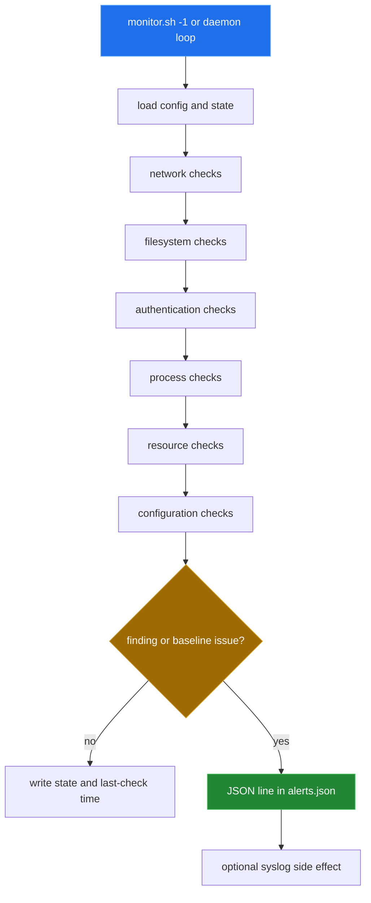
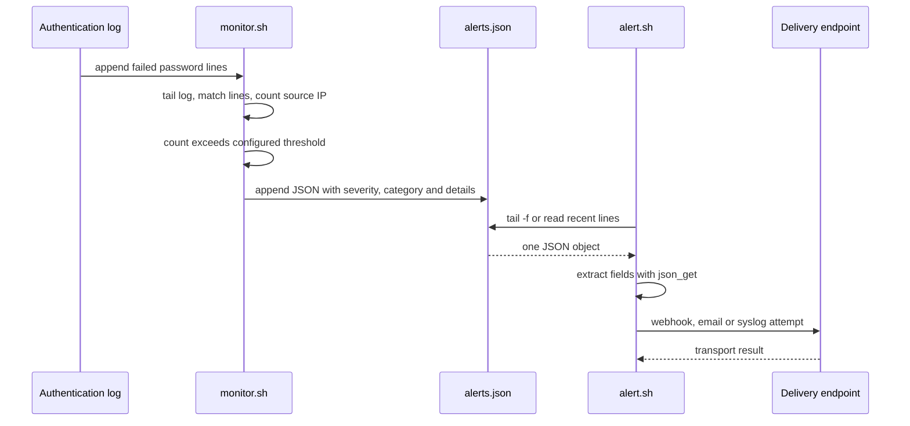

# Detection pipeline

[← back to the overview](../README.md)

`bin/monitor.sh` loads `config/ids.conf`, creates its state directory, and
executes the checks in a fixed order. A check either updates its snapshot or
calls `log_alert()`. The logger writes one JSON object per line when
`ALERT_TO_FILE=1` and can also call `logger` when the optional syslog sink is
enabled.

## What each check detects

The table describes predicates in the checked-in shell, not the broader
coverage described by the older implementation plan.

| Check | Input and predicate | State or output | Severity |
|---|---|---|---|
| `check_port_scans` | `netstat -tn`; counts `ESTABLISHED` and `SYN_RECV` remote addresses; alerts above `PORT_SCAN_THRESHOLD=10` | none | high |
| `check_brute_force` | The first readable `/var/log/auth.log` or `/var/log/secure`; counts failed-password/authentication lines stamped within `AUTH_WINDOW=300` seconds per parsed IPv4 address; alerts above `BRUTE_FORCE_THRESHOLD=5` | none | critical |
| `check_suspicious_connections` | `netstat -tn`; flags established remote ports not in `22,80,443,53,123` and above port `1024` | none | medium |
| `check_file_integrity` | SHA-256, or MD5 fallback, for existing `/etc/passwd`, `/etc/shadow`, `/etc/sudoers` and `/etc/ssh/sshd_config` entries in the expected baseline file | `BASELINE_FILE` | critical; high if baseline absent |
| `check_suid_changes` | SUID/SGID files found below `/bin`, `/sbin`, `/usr/bin` and `/usr/sbin`; alerts newly observed entries | `suid_last.state` | high |
| `check_webshells` | PHP files below `/var/www`, `/usr/share/nginx` and `/usr/share/apache2` containing `eval`, `base64_decode`, `system`, `exec`, `shell_exec`, `passthru` or backticks | none | critical |
| `check_new_users` | `name:uid` pairs from `/etc/passwd`; alerts new pairs | `users_last.state` | high |
| `check_failed_logins` | Counts `authentication failure` lines stamped within `AUTH_WINDOW=300` seconds; alerts above `MAX_FAILED_LOGINS=5` | none | high |
| `check_sudo_usage` | Counts `sudo:` lines stamped within `SUDO_WINDOW=3600` seconds; alerts above `SUDO_ANOMALY_THRESHOLD=10` | none | medium |
| `check_cryptominers` | `ps aux` lines matching `xmrig`, `minerd`, `minergate`, `ethminer`, `cgminer` or `bfgminer` | none | critical |
| `check_hidden_processes` | Compares PIDs from `ps` with numeric `/proc` directories | temporary PID lists | high |
| `check_deleted_binaries` | Reads `/proc/<pid>/exe` and alerts links ending in `(deleted)` | none | high |
| `check_resource_usage` | Parses CPU idle from `top`, memory from `/proc/meminfo`, disk from `df -h`, and process count from `ps`; thresholds are `80%`, `90%`, `90%` and `500` | none | medium; high for process count |
| `check_ssh_config` | Compares `Port`, `PermitRootLogin`, `PasswordAuthentication` and `PubkeyAuthentication` lines | `ssh_last.state` | high |
| `check_cron_changes` | Compares listings of `/etc/cron.d`, `/etc/cron.daily`, `/etc/cron.hourly` and `/etc/crontab` | `cron_last.state` | high |
| `check_new_services` | Compares running systemd units, SysV services, or process names depending on available tools | `services_last.state` | medium |

The three authentication checks read the last `AUTH_LOG_SCAN_LINES` (50000)
lines of the auth log and keep those stamped within the window. They parse the
traditional syslog stamp (local time, no year; a date ahead of now is taken as
last year) and RFC 3339 stamps with a zone. Lines in any other format are
ignored. The port-scan comment describes a sixty-second threshold, but that
check reads a current `netstat` snapshot and does not parse event times.

## One detection firing

This sequence follows the brute-force branch. The source log writer is external
to the repository; the rest is implemented by the scripts here.

The monitor and alert router are separate processes. Running the monitor alone
does not send a webhook or email; it only writes the JSON record and optionally
calls its own syslog branch.

## Firing in a container

`sh tools/container_run.sh` created a disposable Debian GNU/Linux 12
environment, seeded a baseline, ran one cold pass, planted nine test artefacts,
and ran one warm pass. The warm pass exited `0` and wrote `13` records. The
records included brute-force, critical-file, SUID/SGID, webshell, new-user,
failed-login, sudo, cryptominer, deleted-binary, resource and configuration
findings. The exact record text is printed by the harness; the count and exit
status are not inferred from the source.
