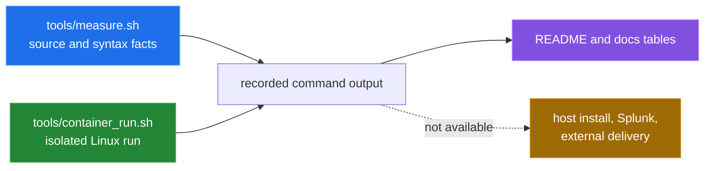

# How this was measured

[← back to the overview](../README.md)

This pass reports source facts separately from runtime measurements. Source
thresholds and paths in the component write-ups were read from the checked-in
shell, configuration, Ansible and Splunk files. They are not performance
claims. Runtime numbers below come from commands actually run in this
workspace.



## Reproducible local measurements

The script created for this pass is [`tools/measure.sh`](../tools/measure.sh).
It uses Git's tracked-file list, `wc`, `awk` and `sh -n`; it does not install a
dependency or write build output.

```sh
sh tools/measure.sh
```

The observed output reported:

| Measurement | Observed result | Provenance |
|---|---:|---|
| implementation shell and Jinja bytes | 73606 | `wc -c` over tracked source `*.sh` and `*.j2` files, excluding docs and measurement tools |
| monitor check functions | 16 | `awk` over `bin/monitor.sh` function declarations |
| shell syntax | pass | `sh -n` over tracked shell files and `tools/*.sh` |

The help paths were also run directly:

```sh
sh bin/monitor.sh -h
sh bin/alert.sh -h
```

Both printed their usage text and exited successfully. The command
`sh bin/setup.sh -s` was run separately and exited with status `1` after the
first missing installer source; that failure is documented in
[`BUGS-FOUND.md`](BUGS-FOUND.md), not hidden from the quick start.

## Isolated runtime measurement

The container harness used for the end-to-end run is
[`tools/container_run.sh`](../tools/container_run.sh). It mounts the repository
read-only into a disposable `debian:12-slim` container, installs `procps` and
`net-tools` inside that container, and invokes the checked-in `monitor.sh`
directly. It does not call the broken installer and does not change the host.

The harness creates a flat SHA-256 baseline specifically because that is the
input format the monitor reads. This is measurement scaffolding, not a repair
to `bin/baseline.sh`; the mismatch is recorded in the bug log.

The run performed these observable stages:

```text
cold monitor pass       -> state snapshots exist
plant test artefacts    -> auth, web, SUID, user, process and config changes
warm monitor pass       -> JSON records printed and counted
```

The observed warm-pass results were:

| Result | Value |
|---|---:|
| monitor exit status | 0 |
| alert records written | 13 |
| wall-clock delta | 257238750 ns |

The same run printed records for brute force, critical-file modification,
SUID/SGID, webshell, new user, failed logins, sudo usage, cryptominer, deleted
binary, CPU usage, SSH configuration and cron configuration. The input fixture
contained 12 failed-password lines and 15 sudo lines, so those output details
are part of the run provenance rather than estimates.

This is a single disposable-container run. The wall-clock value is not a
benchmark and should not be generalized to another host, kernel, container
runtime or log volume.

## What was not measured

- No host installation was run: `bin/setup.sh -s` already fails on the missing
  source name, and a real installation would write system paths.
- No `bin/baseline.sh` run was performed on the host because it writes under
  `/var/lib/ids` and reads sensitive system state.
- No Ansible deployment or remote-host run was performed. Local syntax checking
  was blocked by the configured but absent vault password file.
- No Splunk instance, webhook, email server or syslog endpoint was available
  for delivery verification.
- No animation or generated image was made. The container captured structured
  command output for measurements; the documentation therefore ships Mermaid
  diagrams only rather than presenting a fabricated terminal recording.
