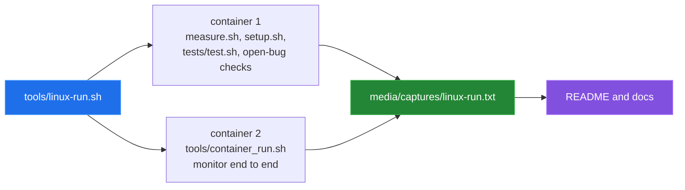

# Measurement

[← back to the overview](../README.md)

Every number in this documentation comes from one script run in Linux
containers:

```sh
sh tools/linux-run.sh > media/captures/linux-run.txt
```

[`tools/linux-run.sh`](../tools/linux-run.sh) mounts the repository read-only
into a disposable `debian:12-slim` container, copies it, and runs the
measurement script, the installer, the test script and the checks for the open
bugs. It then runs [`tools/container_run.sh`](../tools/container_run.sh), which
exercises the monitor end to end in a second container. Nothing runs on the
host. The full output is
[`media/captures/linux-run.txt`](../media/captures/linux-run.txt); every block
below is taken from it.



## Environment

| | |
|---|---|
| Kernel | Linux 6.5.11-linuxkit, aarch64 (Docker Desktop VM) |
| Image | `debian:12-slim` (`sha256:3783cc01…906251`), Debian GNU/Linux 12 |
| `/bin/sh` | `dash` |
| Extra packages | `procps`, `net-tools` (and `git` for `measure.sh`) |
| Date | 2026-09-24 |

## Repository facts

`tools/measure.sh` sums the tracked implementation `*.sh` and `*.j2` files,
counts the monitor's check functions, and runs `sh -n` on every tracked shell
script:

```text
implementation shell and Jinja bytes: 73538
monitor check functions: 16
shell syntax: pass
```

## Help output

```text
bin/monitor.sh -h  exit=0
bin/alert.sh -h    exit=0
```

## Installer

`sh bin/setup.sh -s` (simulate) and then `sh bin/setup.sh` as root inside the
container:

```text
=== bin/setup.sh -s (simulate)
exit=0
[INFO] [SIMULATE] Would install: bin/monitor.sh -> /usr/local/bin/ids_monitor (perms: 755)
[INFO] [SIMULATE] Would install: bin/baseline.sh -> /usr/local/bin/ids_baseline (perms: 755)
[INFO] [SIMULATE] Would install: bin/alert.sh -> /usr/local/bin/ids_alert (perms: 755)
[INFO] [SIMULATE] Would install: ids_config.conf -> /etc/ids/ids_config.conf

=== bin/setup.sh (real install, as root, inside this container)
exit=0
[INFO] Installed: /usr/local/bin/ids_monitor
[INFO] Installed: /usr/local/bin/ids_baseline
[INFO] Installed: /usr/local/bin/ids_alert
[INFO] Installed: /etc/ids/ids_config.conf
[INFO] Created init script: /etc/init.d/ids-monitor
```

This confirms fix 1 in [Bugs found](BUGS-FOUND.md). The container has no
systemd, so setup writes an init.d script instead of a unit.

## Test script

`sh tests/test.sh -c /etc/ids/ids_config.conf` in safe mode, once on the fresh
install and once with an earlier record in `alerts.json`:

```text
=== tests/test.sh after a fresh install (empty alerts.json)
exit=1
last test started: Test 8: Alert generation (simulated)
runtime [PASS] lines: 6
runtime [FAIL] lines: 2
(no summary printed)

=== tests/test.sh with one earlier record in alerts.json
exit=1
last test started: Test 10: Service monitoring
runtime [PASS] lines: 10
runtime [FAIL] lines: 2
[TEST] Tests run: 10
[TEST] Passed: 10
[TEST] Failed: 2
[TEST] Result: SOME TESTS FAILED
```

The second run shows fix 6: the summary counts match the printed results. The
first run is open bug 10. The two failures in both runs are the missing
baseline file and the missing auth log.

## Open bugs

```text
=== open: baseline producer and monitor input
10:BASELINE_FILE="/var/log/ids/baseline.dat"
/var/lib/ids/baseline (baseline.sh writes): present, 43 files
/var/log/ids/baseline.dat (monitor.sh reads): absent

=== open: syslog priority built from an IDS severity
96:        logger -t "ids" -p "security.$severity" "$category: $description"
logger: unknown priority name: medium
logger -p security.medium  exit=1
```

These are bugs 2 and 3.

## Monitor end to end

`tools/container_run.sh` copies the configuration with the syslog sink turned
off (bug 3), writes the flat SHA-256 baseline the monitor reads (bug 2 means
nothing else writes it), and runs `bin/monitor.sh -1` twice. Between the passes
it plants harmless test artefacts:

```text
  /var/log/auth.log         12 failed passwords from 203.0.113.9
  /var/log/auth.log         15 sudo invocations
  /var/www/html/uploads.php eval() one-liner
  /usr/bin/backdoor         mode 4755
  /etc/passwd               new account eviluser (uid 1337)
  /usr/local/bin/xmrig      running (a renamed sleep)
  /tmp/ghost                running, binary deleted
  /etc/ssh/sshd_config      PermitRootLogin yes
  /etc/cron.d/implant       new cron entry
```

The warm pass exited 0 and wrote 13 alert records:

| Category | Record |
|---|---|
| authentication | Brute force attack detected |
| filesystem | Critical file modified (×2) |
| filesystem | New SUID/SGID file detected |
| filesystem | Potential webshell detected |
| authentication | New user created |
| authentication | Excessive failed login attempts |
| authentication | Unusual sudo activity |
| process | Potential cryptominer detected |
| process | Process running deleted binary |
| resources | High CPU usage |
| configuration | SSH configuration changed |
| configuration | Cron configuration changed |

```text
== alerts by category and severity ==
      3 filesystem critical
      2 configuration high
      2 authentication high
      1 resources medium
      1 process high
      1 process critical
      1 filesystem high
      1 authentication medium
      1 authentication critical

== resource cost of one pass ==
  wall clock (ns diff)      : 306584042
```

That is about 0.31 s for one pass in this container. It is one run, not a
benchmark.

## Not covered

- Ansible. No playbook was run and no host was contacted (bug 7).
- Splunk, webhooks, email and remote syslog. None was available, so no alert
  delivery was tested (bug 5 covers the Splunk mismatch).
- The monitor's daemon mode and the init.d service; only single passes ran.
