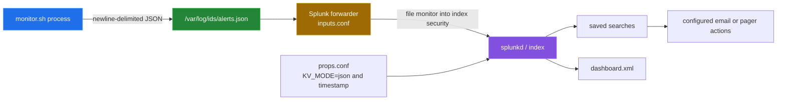

# Splunk integration

[← back to the overview](../README.md)

The monitor's local hand-off is newline-delimited JSON in
`/var/log/ids/alerts.json`. `splunk/inputs.conf` monitors that file as
sourcetype `linux_ids`, and the props, saved searches and dashboard use the
keys and values the monitor writes.

No Splunk instance was run. `tests/static/splunk_fields.py` checks the
contract statically; see [Verification](#verification).

## Actual local format

`bin/monitor.sh` builds one JSON object with these keys:

| Key | Meaning in the monitor |
|---|---|
| `timestamp` | UTC timestamp written by `date` |
| `hostname` | value loaded from `hostname` in the config |
| `severity` | configured string such as `critical`, `high` or `medium` |
| `category` | monitor category such as `authentication` or `filesystem` |
| `description` | human-readable finding description |
| `details` | optional free-text detail string |

The record is appended to `/var/log/ids/alerts.json` when
`ALERT_TO_FILE=1`. The monitor can also print it when
`ALERT_TO_STDOUT=1`. Its optional syslog branch is a separate side effect; it
does not create a Splunk event by itself.

## What the Splunk files configure

| File | What it configures |
|---|---|
| `splunk/inputs.conf` | `alerts.json` as `linux_ids`, plus auth, kernel, system, web, package, firewall and audit logs under their own sourcetypes; no scripted inputs |
| `splunk/props.conf` | `linux_ids` as JSON with the `timestamp` key parsed as UTC; extractions from `details` (`src`, `file_path`, `process`, `pid`, `user`, `uid`, `attempt_count`, `usage_percent`, `dest_port`); CIM aliases `dest`, `signature`, `signature_type`; a `risk_score` eval |
| `splunk/savedsearches.conf` | scheduled searches with email/PagerDuty actions, keyed on the `category` and `description` values the monitor writes |
| `splunk/dashboard.xml` | charts and tables for severity, hosts, categories, processes and resources from the same fields |

The input stanzas specify index `security` for IDS and security logs, with
other system and web logs routed to `os` or `web`. File monitoring is the
forwarder's transport; no HTTP Event Collector client appears in the checked-in
shell scripts. The saved searches specify scheduled queries and actions, but
they cannot be considered verified without a Splunk instance receiving matching
events.

## Boundary of the alert router

`bin/alert.sh` is independent of Splunk. In tail mode it follows the local
alert file; otherwise it processes the recent tail of that file. For each JSON
line it can attempt:

- a Slack-compatible webhook using `curl` or `wget`;
- email for `critical` and `high` records using `mail`, `sendmail` or `mailx`;
- local syslog through `logger`, or a TCP endpoint through `nc` or `telnet`.

These are transport attempts, not delivery guarantees. None of them has been
tested against a real webhook, mail system, syslog endpoint or Splunk
instance.

## Verification

`tests/static/splunk_fields.py` runs in `sh tests/docker.sh`. It reads
`config/ids.conf` and `bin/monitor.sh`, then checks that:

- the only `linux_ids` input is the configured `ALERT_LOG`, and no input names
  an IDS file the monitor does not write;
- `TIME_PREFIX` and `TIME_FORMAT` parse the monitor's timestamp;
- each extraction returns the expected value from a sample `details` string
  for every alert description that has one;
- every field a search or dashboard panel uses is a JSON key, an extraction,
  an alias, an eval, a Splunk default or created in the search, and every
  severity, category and description literal is one the monitor writes.

Splunk itself was not installed or run.
