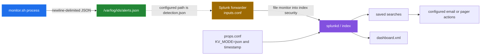

# Splunk integration

[← back to the overview](../README.md)

The repository contains Splunk configuration, but the checked-in monitor and
the Splunk files currently describe different contracts. The monitor's actual
local hand-off is newline-delimited JSON in `/var/log/ids/alerts.json`. The
Splunk inputs file primarily names `/var/log/ids/detection.json`, which the
monitor does not write.

The dashed edge is deliberate: it marks the path the checked-in Splunk
configuration intends to monitor, not a path proven to receive current monitor
records.

## Actual local format

`bin/monitor.sh` builds one JSON object with these keys:

| Key | Meaning in the monitor |
|---|---|
| `timestamp` | UTC timestamp written by `date` |
| `hostname` | value loaded from `hostname` in the config |
| `severity` | configured string such as `critical`, `high` or `medium` |
| `category` | monitor category such as `authentication` or `filesystem` |
| `description` | human-readable finding description |
| `details` | optional free-text detail string |

The record is appended to `/var/log/ids/alerts.json` when
`ALERT_TO_FILE=1`. The monitor can also print it when
`ALERT_TO_STDOUT=1`. Its optional syslog branch is a separate side effect; it
does not create a Splunk event by itself.

## What the Splunk files configure

| File | Checked-in intent | Important current mismatch or boundary |
|---|---|---|
| `splunk/inputs.conf` | monitor IDS, auth, kernel, system, web, package, firewall and audit logs | primary IDS path is `detection.json`; several script stanzas name files not in `bin/` |
| `splunk/props.conf` | parse `linux_ids` as JSON and use `timestamp` | also extracts `event_type` and aliases `source_ip`, which the monitor does not emit |
| `splunk/savedsearches.conf` | scheduled searches and email/PagerDuty actions | searches use schemas such as `event_type`, `threat_category`, `process_name` and `query_length` absent from monitor records |
| `splunk/dashboard.xml` | charts and tables for severity, hosts, categories, processes and resources | queries likewise expect fields and event types not produced by the monitor |

The input stanzas specify index `security` for IDS and security logs, with
other system and web logs routed to `os` or `web`. File monitoring is the
forwarder's transport; no HTTP Event Collector client appears in the checked-in
shell scripts. The saved searches specify scheduled queries and actions, but
they cannot be considered verified without a Splunk instance receiving matching
events.

## Boundary of the alert router

`bin/alert.sh` is independent of Splunk. In tail mode it follows the local
alert file; otherwise it processes the recent tail of that file. For each JSON
line it can attempt:

- a Slack-compatible webhook using `curl` or `wget`;
- email for `critical` and `high` records using `mail`, `sendmail` or `mailx`;
- local syslog through `logger`, or a TCP endpoint through `nc` or `telnet`.

These are transport attempts, not delivery guarantees. None of them has been
tested against a real webhook, mail system, syslog endpoint or Splunk
instance.

## Known integration gap

The path and schema mismatches are
[bug 5](BUGS-FOUND.md#5-splunk-input-paths-and-field-names-do-not-match-the-monitor).
It is open because the fix changes the SIEM contract that saved searches,
dashboards and existing indexed data depend on.
